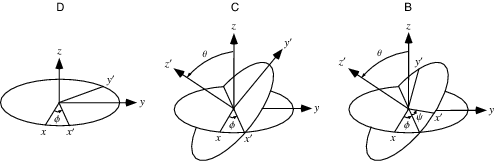

欧拉角和旋转矩阵的之间的转换是空间定位中经常碰到的问题，只有清楚其中的理论细节才能得到正确的转换结果，这篇文章的目的是重新梳理欧拉角和旋转矩阵的相关原理，作为之后遇到相关问题的参考文档。

## Euler Angle

欧拉角是将三维旋转矩阵分解，得到的围绕坐标轴的三个连续旋转的角度。对三维旋转矩阵的分解最早是由Paul B. Davenport开始研究的。三次连续的旋转角度来描述刚体在坐标系中的旋转时，需要保证第二次旋转的旋转轴和另外两次是正交的。根据旋转轴的不同，欧拉角又分为了**Proper Euler Angles**和**Tait–Bryan Angles**。此外；旋转的表示可以相对于动态的坐标系，即每次旋转都是相对于当前的刚体坐标系，这种旋转叫做**内旋**；旋转的表示也可以相对于固定的坐标系，即定义一个世界坐标系，三次旋转的角度都是相对于世界坐标系，这种旋转叫做**外旋**。

   **Proper Euler Angles**
   这种类型的欧拉角在表示旋转的时候，第一次旋转的轴和最后一次旋转的轴相同。其中又包括:

   $$X-Y-X、Y-X-Y、Z-X-Z、X-Z-X、Y-Z-Y、Z-Y-Z$$.

   **Tait–Bryan Angles**
   这种类型的欧拉角在表示旋转的时候，每次旋转的轴都是不同的。其中又包括：

   $$X-Y-Z、Y-X-Z、Z-X-Y、X-Z-Y、Y-Z-X、Z-Y-X$$.

   **内旋**
   内旋的每次旋转是按照旋转以后的物体坐标系进行下一次旋转。例如假设世界坐标为$$XYZ$$，物体的坐标系为$$xyz$$，按照X-Y-Z顺序定义的内旋欧拉角表示的旋转是：先绕着世界坐标X进行第一次旋转，得到物体在世界坐标系下的姿态$$x_2y_2z$$，接下来的第二次旋转是绕着$$y_2$$进行的，旋转后得到物体在世界坐标系下的姿态为$$x_3y_2z_3$$，最后一次旋转是绕着$$z_3$$进行。

   **外旋**
   外旋的每次旋转始终是绕着世界坐标系进行的。外旋描述相对比较简单，所有的旋转都是绕着世界坐标系的轴进行的。
   
   **内旋和外旋的关系**
   在实际应用中，如果将欧拉角转换为旋转矩阵，那么内旋和外旋是有一定的关系的。这个关系是：以X-Y-Z内旋的欧拉角为例，它和Z-Y-X外旋的欧拉角描述的旋转矩阵是等价的。对一个刚体进行一次绕着某个轴的内旋，就是将该刚体的姿态R的右边乘以一个绕着某个轴的旋转矩阵。而对一个刚体进行一次绕着某个轴的外旋，就是将该刚体的姿态R的左边乘以一个绕着某个轴的旋转矩阵。

明确了旋转顺序和旋转方式以后，一个欧拉角才能准确的对应到一个旋转。