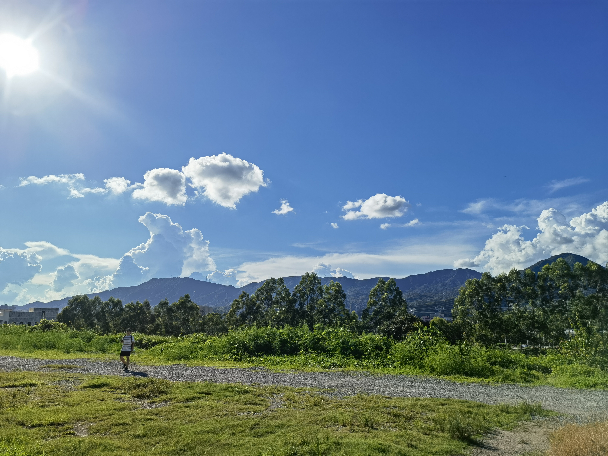

今天开通了我的博客空间。一直以来都想记录一些东西，然而始终没有开始做这件事情，可能最难的就是如何开始吧。

前几天和2号去了一趟大鹏，两个人背上包，坐上公交就去了。后来在大鹏所城的书店里坐着，两个人互相做了一段访谈，用vlog的形式记录下了一些想法，忽然觉得好有意思啊。忙碌和闲散的时光渐渐的流走，都忘记了该停下来记录一下当前的状况。周末的时候又翻出当时拍的视频，重新看到这段聊天的时候，瞬间觉得回到记忆中的一个美好的时间点，是一件那么让人心满意足的事情。所以，我想应该把一些东西记录下来，在将来的某个时间点回头看看，一定非常有意思。

希望自己可以坚持做这件事情！

今天从同事那里学到一个道理，过分的边界判断，可能会将问题隐藏。这个道理就好像过分的宽容会就是纵容一样。