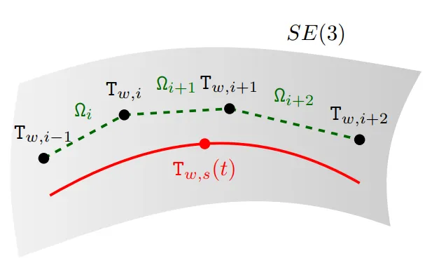
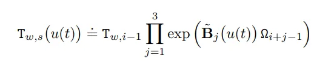
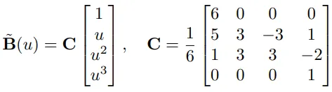
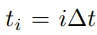
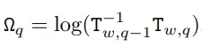

### B-Spline插值拟合公式

<div align=center>

</div> 
 <div align=center>

</div> 
<div align=center>

</div> 
<div align=center>

</div> 

$$u(t)=(t-t_i)/{\Delta}t$$

<div align=center>

</div> 

### 6DOF插值代码
``` c++
Sophus::SE3d cur;
Sophus::SE3d t1(T_1.rot_quat, T_1.position);
Sophus::SE3d t2(T_2.rot_quat, T_2.position);
Sophus::SE3d t3(T_3.rot_quat, T_3.position);
Sophus::SE3d t4(T_4.rot_quat, T_4.position);	
cur = Sophus::SE3d::exp(t1.log())*
    Sophus::SE3d::exp(((5 + 3 * u - 3 * u*u + u * u*u) / 6)*fromAtoB(t1, t2).log())*
    Sophus::SE3d::exp(((1 + 3 * u + 3 * u*u - 2 * u*u*u) / 6)*fromAtoB(t2, t3).log())*
    Sophus::SE3d::exp(((u*u*u) / 6)*fromAtoB(t3, t4).log());
result.rot_quat = Eigen::Quaterniond(cur.rotationMatrix());
result.position = cur.translation();
```

### 总结
1. 三次样条曲线需要四个控制点；
2. 该方法使用了均匀B样条：Δt长度固定；
3. 样条曲线在区间t∈[ti, ti+1)的值，受{ti-1, ti, ti+1, ti+2}处的值控制；
4. 所以上述方法只能做插值，没办法做预测。


<center>《预测：方法与实践》</center>

也就是说样条法适合做回归，不适合做预测。

### Reference
[1] Mueggler, E., Gallego, G., Rebecq, H., & Scaramuzza, D. (2018). Continuous-time visual-inertial odometry for event cameras. IEEE Transactions on Robotics, 34(6), 1425-1440.
[2] https://otexts.com/fpp3cn/holt-cn.html